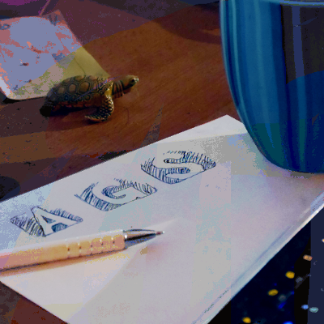

# Adventure Game Studio Help Files

Travis (web): 

Appveyor (chm): 

## Editing the help files

[**Edit the Help in the Wiki**](https://github.com/adventuregamestudio/ags-manual/wiki) | [**Revision History**](https://github.com/adventuregamestudio/ags-manual/wiki/_history)

The help files can be edited on the wiki or cloned locally and pushed. Please open an [issue](https://github.com/adventuregamestudio/ags-manual/issues) if something is wrong.

    git clone https://github.com/adventuregamestudio/ags-manual.wiki.git

## Reading the help files

The manual is hosted online on [adventuregamestudio.github.io/ags-manual/](https://adventuregamestudio.github.io/ags-manual/). You can also download the [latest release](https://github.com/adventuregamestudio/ags-manual/releases/latest).

## Building the help files

The help files are generated using [Pandoc](https://pandoc.org/) and [GNU Make](https://www.gnu.org/software/make/)!

### Getting Pandoc

The build process relies on Lua filter support, which was added in Pandoc version 2, and was further improved in later versions. It is recommended to use the [latest version](https://github.com/jgm/pandoc/releases/latest) of Pandoc regardless of platform.

For Windows, Pandoc is also available for installation using the [Chocolatey](https://chocolatey.org/) package manager which will retrieve the binary and add it to your PATH.

    choco install pandoc

### Getting GNU Make

If using macOS or Linux it is likely that you already have a version of GNU Make installed. Other Unix platforms may require that GNU Make is installed separately, typically it is packaged under the name ['gmake'](http://pkgsrc.se/devel/gmake).

For Windows, the easiest installation method is using the [Chocolatey](https://chocolatey.org/) package manager which will retrieve the binary and add it to your PATH.

    choco install make

...or if manual installation is preferred, the same binary can also be downloaded from [ezwinports](https://sourceforge.net/projects/ezwinports/).

### Getting curl

If using macOS or Linux it is likely that you already have a version of curl installed, or it will be packaged under the name ['curl'](http://pkgsrc.se/www/curl). It is also included with recent versions of Windows.

For older versions of Windows, the easiest installation method is using the [Chocolatey](https://chocolatey.org/) package manager which will retrieve the binary and add it to your PATH.

    where curl || choco install curl

...or if manual installation is preferred, the same binary can also be downloaded from [curl.haxx.se](https://curl.haxx.se/windows/).

**Note: curl is only required for the html target**

### Getting the HTML help compiler

As far as we know, the compiler that comes with [HTML Help Workshop](http://go.microsoft.com/fwlink/?LinkId=14188) is the only way to create a CHM file with working and complete indices. Unfortunately this makes the final compilation stage only possible on Windows.

The easiest installation method is using the [Chocolatey](https://chocolatey.org/) package manager.

    choco install html-help-workshop

**Note: HTML Help Workshop is only required for the htmlhelp target**

### Make variables and targets

variable | function
--- | ---
CHECKOUTDIR | path to checked out wiki source
HHC | path to the HTML Help Compiler
CURL | path to the curl binary (defaults to 'curl')
PANDOC | path to the Pandoc binary (defaults to 'pandoc')

target | function
--- | ---
source | update the source directory from CHECKOUTDIR
html | build the website into 'html/build' (requires curl)
htmlhelp | build an HTML Help Project into 'htmlhelp/build' and call HHC if set (requires HTML Help Workshop)
metacheck | validate generated page metadata (currently checks page links and index entries)
clean | delete everything listed in .gitignore

### Build example (Windows and Chocolatey)

    choco install curl html-help-workshop pandoc make
    refreshenv
    git clone https://github.com/adventuregamestudio/ags-manual.wiki
    git clone https://github.com/adventuregamestudio/ags-manual
    set CHECKOUTDIR=%CD%\ags-manual.wiki
    set HHC=%PROGRAMFILES(X86)%\HTML Help Workshop\hhc.exe
    cd ags-manual
    make SHELL=%COMSPEC% source
    make SHELL=%COMSPEC% -j metacheck
    make SHELL=%COMSPEC% -j html htmlhelp

### Build example (macOS/Linux/... and downloaded pandoc binary)

    git clone https://github.com/adventuregamestudio/ags-manual.wiki
    git clone https://github.com/adventuregamestudio/ags-manual
    export CHECKOUTDIR=$(pwd)/ags-manual.wiki
    export PANDOC=~/bin/pandoc
    cd ags-manual
    make source
    make -j metacheck
    make -j html htmlhelp
